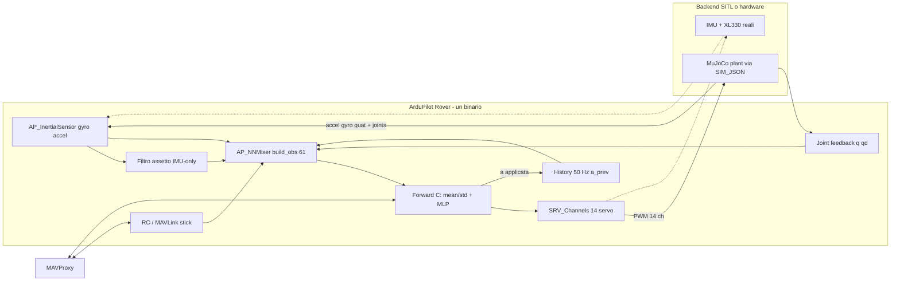

# NNMixer su ArduPilot — task PPO nel firmware, MuJoCo come pianta SITL

**Autore:** Roberto Navoni — DelphyAI LAB  
**Contatto:** r.navoni74@gmail.com  
**Data:** 24 settembre 2026  
**Stato:** implementato e validato in SITL (§11); repo privato `virtualrobotix/microduck-ap-ppo-sitl`  
**Disclaimer:** *Developed by Roberto Navoni : r.navoni74@gmail.com*

Portare la policy PPO MLP del NNMixer (61 obs → 14 azioni, 50 Hz) **dentro ArduPilot** come task dello scheduler, in modo che lo stesso sorgente giri prima in SITL su Linux/macOS e poi sul microcontrollore del flight controller. MuJoCo non è un secondo autopilota: è il **backend fisico del SITL**, esattamente come Gazebo o RealFlight per un drone. Il test e il comando passano da **MAVProxy**.

Documenti collegati: training e reti validate nel laboratorio NOESIS EXPERIMENT.

---

## 1. Obiettivo e vincoli

| Vincolo | Motivo |
|---|---|
| **Un solo binario** ArduPilot (Rover + `AP_NNMixer`) | Il target finale è lo stesso MCU dell’autopilota. Niente companion, niente secondo SITL |
| **Inerziali solo da ArduPilot** (`AP_InertialSensor`) | Il task non deve sapere che esiste MuJoCo. Sostituire il simulatore con IMU + XL330 reali non cambia una riga |
| **Contratto rete immutato** | 61 float32 SI in ingresso, 14 float32 rad in uscita, 50 Hz, `q_target = q0 + a`. Nessun riaddestramento |
| **Inferenza in C puro** (float32) | Nessun ONNX Runtime nel firmware: lo stesso codice compila su SITL e su STM32. ONNX serve solo ai test di parità in Python |
| **Rete validata** | MLP `mlp_2048x2000` (iter 1999), export ONNX 18–19 set 2026 |
| **Configurazione MuJoCo attuale** | `scene_walk.xml` / `scene.xml`, `timestep 0.005`, decimazione 4 → 50 Hz, attuatori BAM XL330, `DEFAULT_POSE` STAND2 |

---

## 2. Architettura

Il loop chiuso è **MuJoCo → SITL → INS → AP_NNMixer → SRV → SITL → MuJoCo**. Il task PPO vede solo API ArduPilot.

### 2.1 Loop a 50 Hz (identico in SITL e su MCU)

1. `AP_InertialSensor` fornisce gyro e accel body (frame FRD di ArduPilot).
2. Un filtro assetto **IMU-only** (complementare/Mahony, dentro `AP_NNMixer`) dà il quaternion trunk → gravity proiettata. EKF3 **non** entra nell’osservazione.
3. Joint feedback: 14 posizioni e velocità (in SITL dal JSON di MuJoCo, sul robot dal bus Dynamixel).
4. Stick / MAVLink → twist `vx, vy, ωz` in SI.
5. `build_obs()` concatena i 61 float32 (con `a_prev` dal buffer storia).
6. Forward C: `(obs − mean) / std` → rete → `a[14]`; clip; watchdog.
7. `q_target = q0 + a` → `SRV_Channels` (PWM in SITL, protocollo Robotis su hardware). `a` viene salvata come `a_prev`.

Se il task salta un tick o il feedback manca: `a = 0` (posa stand), scritto **anche** nella storia.

---

## 3. Contratto numerico della rete

Tutti i valori sono **IEEE float32 little-endian**, SI, vettore denso `[1, 61]`. L’ordine dei 14 giunti è: `left_hip_yaw, left_hip_roll, left_hip_pitch, left_knee, left_ankle, neck_pitch, head_pitch, head_yaw, head_roll, right_hip_yaw, right_hip_roll, right_hip_pitch, right_knee, right_ankle`.

| Slice | Dim | Grandezza | Unità | Fonte in ArduPilot |
|---|---:|---|---|---|
| `[0:3]` | 3 | Velocità angolare trunk (roll, pitch, yaw) | rad/s | `INS` gyro, riportato nel frame trunk |
| `[3:6]` | 3 | Gravità proiettata nel frame trunk | vettore unitario (stand ≈ `[0,0,−1]`) | quaternion IMU-only × `(0,0,−1)` |
| `[6:20]` | 14 | `q − q0` | rad | joint feedback − `DEFAULT_POSE` |
| `[20:34]` | 14 | `q̇` | rad/s | joint feedback |
| `[34:48]` | 14 | azione precedente applicata | rad | buffer storia del task |
| `[48:51]` | 3 | twist `vx, vy, ωz` | m/s, m/s, rad/s | stick / MAVLink, saturati |
| `[51:55]` | 4 | comando testa (Δ neck/head pitch, yaw, roll) | rad | 0 (non usato in questa fase) |
| `[55:61]` | 6 | comando corpo Δx,y,z, Δroll,pitch,yaw | m, rad | 0 (non usato) |

Uscita: `a[14]` in rad, `q_target = q0 + a`, scala 1.0.

`q0` (STAND2, rad): `[0, −0.0873, −0.4579, −0.0049, 0.4530, 0.3491, 0.3491, 0, 0, 0, 0.0873, 0.4579, 0.0049, −0.4530]`.

Range di training del twist: `vx ∈ [−0.4, 0.4]`, `vy ∈ [−0.3, 0.3]`, `ωz ∈ [−1.0, 1.0]`. Stick al centro = zeri = stand (comportamento addestrato esplicitamente).

### 3.1 Dove sta la normalizzazione (z-score)

In training la rete ha davanti un modulo `EmpiricalNormalization`: accumula media e varianza di ciascuno dei 61 slot e calcola `(obs − mean) / std`. A fine training `mean[61]` e `std[61]` sono **parametri salvati nel checkpoint**, come i pesi. `scripts/export.py` traccia `actor(normalizer(obs))`: nel grafo ONNX i primi nodi sono `Sub` e `Div` con quelle costanti, poi le `MatMul`.

Conseguenze per ArduPilot:

- l’ingresso alla rete sono **obs grezzi in SI**; il task non stima nulla online;
- l’export C dei pesi porta con sé `mean[61]` e `std[61]` (122 float in flash) ed esegue lo stesso `Sub/Div` come primo strato;
- la “normalizzazione” che fa ArduPilot è **solo frame + unità + convenzioni** (paragrafo 4).

---

## 4. I quattro adattatori ArduPilot → PPO

### 4.1 IMU: frame e filtro

ArduPilot lavora in **FRD** (x avanti, y destra, z giù). Il trunk NNMixer in MuJoCo è **FLU** (x avanti, y sinistra, z su). Conversione:

- gyro: `(ωx, −ωy, −ωz)`
- gravità: in FRD a robot livellato è `[0,0,+1]`; in FLU diventa `[0,0,−1]` con `(gx, −gy, −gz)`.

A questo si somma la rotazione fissa di montaggio IMU→trunk (parametro, identità in SITL).

Sorgente dell’assetto: in training la gravity proiettata viene dal quaternion IMU (con domain randomization sul disallineamento), sul robot Pollen dal filtro SFLP del chip IMU. L’analogo su ArduPilot è un **filtro complementare su gyro+accel grezzi** dentro `AP_NNMixer` (poche righe, costa nulla su MCU, nessuna dipendenza da EKF/GPS). Parametro `NNM_ATT_SRC` per confrontare con il quaternion `AP_AHRS` in fase di debug.

### 4.2 Storia

La rete non è Markov sui soli sensori. Il task tiene un buffer a 50 Hz:

- `a_prev[14]`: l’azione **effettivamente inviata** al passo precedente (dopo clip e watchdog), non il raw della rete;
- al boot `a_prev = 0`; su timeout o disarm `a_prev = 0`.

Se in training è attivo un ritardo 0–1 step sul gyro, lo stesso FIFO va replicato qui (`NNM_IMU_LAG`).

### 4.3 Feedback attuatori

Gli slice `[6:34]` devono venire dallo **stato reale** dei giunti, non dal target. In SITL MuJoCo restituisce `q`, `q̇` di ogni step nel JSON; il backend `SIM_JSON` li espone a un piccolo singleton `AP_JointFeedback` che il task legge. Su hardware lo stesso singleton è alimentato da una lettura Dynamixel (present position/velocity). Fallback esplicito, mai silenzioso: se il feedback è più vecchio di 40 ms → stand.

### 4.4 Stick → twist

Da RC (`RC_Channels`) o MAVLink (`MANUAL_CONTROL`, `SET_POSITION_TARGET_LOCAL_NED` in GUIDED):

- `vx = norm(ch_pitch) × NNM_VX_MAX` (0.4 m/s)
- `vy = norm(ch_roll) × NNM_VY_MAX` (0.3 m/s)
- `ωz = norm(ch_yaw) × NNM_WZ_MAX` (1.0 rad/s) — è una velocità angolare, non m/s

`norm()` porta 1000–2000 µs in [−1, 1] con deadzone. Modalità: `MANUAL` = stick; `HOLD` = twist 0 (stand); disarmato = `a = 0` e coppia off. Failsafe RC → twist 0.

---

## 5. Integrazione in ArduPilot

Fork `virtualrobotix/ardupilot`, branch `microduck-ppo`, su `master` upstream aggiornato.

| Componente | Cosa cambia |
|---|---|
| `libraries/AP_NNMixer/` | Nuova libreria: `build_obs`, filtro assetto, storia, forward C, parametri `NNM_*`, logging |
| `libraries/AP_NNMixer/policy_mlp.h` | Pesi + `mean/std` come array `const float` generati da NOESIS |
| `Rover/` | Task `AP_NNMixer::update` a 50 Hz nella tabella scheduler; in `MANUAL`/`HOLD` l’uscita servo 1–14 è del task |
| `libraries/SRV_Channel` | Funzioni `k_scripting1..14`; PWM 1000–2000 ↔ rad con `pwm = 1500 + 500·q/(π/2)` (1 µs ≈ 3 mrad) |
| `libraries/SITL/SIM_JSON.cpp` | Parsing del campo opzionale `"joints": {"pos":[14], "vel":[14]}` → `AP_JointFeedback` |
| `libraries/AP_JointFeedback/` | Singleton con timestamp; backend SITL (JSON) e, in futuro, Robotis |

Parametri: `NNM_ENABLE`, `NNM_POLICY` (0 MLP), `NNM_VX_MAX`, `NNM_VY_MAX`, `NNM_WZ_MAX`, `NNM_WD_MS` (40), `NNM_ATT_SRC`, `NNM_ATT_TAU`, `NNM_RC_VX/VY/WZ`, `NNM_ACT_MAX`, `NNM_LOG`, `NNM_HOLD_MODE`, `NNM_SRV_FN0`. Nel file SITL vanno anche `INS_GYRO_FILTER 0` e `INS_ACCEL_FILTER 20` (vedi §11).

Telemetria: `NAMED_VALUE_FLOAT` `PPO_MS` (tempo forward), `PPO_UP` (gz proiettata), `PPO_VX` (comando); messaggio DataFlash `PPO` con obs compressi e 14 azioni per il replay offline.

### 5.1 Inferenza in C

- **MLP**: normalizer → `Linear(61,512)+ELU → Linear(512,256)+ELU → Linear(256,128)+ELU → Linear(128,14)`. ~198k parametri (~790 KB float32).

Test di parità in Python: stesso `obs` → ONNX Runtime vs eseguibile C, errore massimo < 1e-4.

---

## 6. MuJoCo come pianta SITL

Script `plant/mujoco_json_plant.py` (repo del progetto, ambiente `uv` con `mujoco`, `numpy`):

1. Riceve dal SITL su UDP 9002 il pacchetto binario servo (magic, frame rate, frame count, 16 PWM).
2. Decodifica i 14 PWM in `q_target` rad e li applica come `ctrl` (mouth a riposo, mapping 14↔15 come in `body_server.py`).
3. Esegue `mj_step` con `timestep 0.005` (`SIM_RATE_HZ = 200` → un passo per frame; il task a 50 Hz vede 4 passi, come in training).
4. Risponde su 9003 con JSON: `timestamp`, `imu.gyro` e `imu.accel_body` (**convertiti in FRD**), `quaternion`, `position`, `velocity`, più l’estensione `joints.pos` / `joints.vel`.

Attuatori: BAM XL330 se disponibile nel modello caricato (stessa configurazione di `infer_policy.py`), altrimenti PD di posizione dichiarato a log. Viewer passivo per vedere il duck.

Il lock-step del protocollo JSON garantisce che SITL e MuJoCo avanzino insieme: non ci sono due clock.

---

## 7. Procedura di lavoro

1. **Repo progetto** `microduck-ap-ppo-sitl` (accanto a NOESIS, GitHub privato): `ardupilot/` come submodule del fork, `plant/`, `policies/` (ONNX validati copiati), `tools/` (export pesi → C, test parità), `docs/`.
2. **ArduPilot**: clone `master`, `Tools/environment_install/install-prereqs-mac.sh`, `./waf configure --board sitl`, `./waf rover`. Verifica che `sim_vehicle.py -v Rover -f JSON` parta con un plant vuoto.
3. **Pianta MuJoCo**: script JSON con la scena attuale; test standalone con il SITL non modificato (IMU e posizione visibili in MAVProxy).
4. **Export pesi** MLP da `.pt` → header C + `mean/std`; parità ONNX vs C.
5. **`AP_NNMixer`** + `AP_JointFeedback` + estensione `SIM_JSON`; task scheduler; parametri; logging.
6. **Validazione MAVProxy** (paragrafo 8) con MLP.
7. Stima budget MCU (paragrafo 9).

---

## 8. Piano di test con MAVProxy

Lancio: `sim_vehicle.py -v Rover -f JSON --console --map` con il plant MuJoCo attivo.

| Test | Comandi MAVProxy | Criterio |
|---|---|---|
| Parità obs | `param set NNM_ENABLE 1`; log `PPO` | Stesso stato MuJoCo → obs AP vs `infer_policy.get_observations`: errore < 1e-3 |
| Frequenza | `status`, `PPO_MS` | 50 Hz ± 1 tick; forward p99 < 5 ms su Mac |
| Stand | `arm throttle`, stick centrati 20 s | Nessuna caduta, `PPO_UP` ≈ −1 |
| Avanti | `rc 2 1750` (≈ +0.2 m/s) 10 s | Velocità media MuJoCo entro ±30% del comando, nessuna caduta |
| Laterale | `rc 1 1650 / 1350` | Traslazione nel verso giusto |
| Rotazione | `rc 4 1750` (ω ≈ +0.5 rad/s) | Yaw rate nel verso giusto |
| HOLD | `mode HOLD` | Twist forzato a 0, il duck si ferma in piedi |
| Failsafe | `rc 3 900` / stop plant | Entro 40 ms `a = 0`, stand; ripresa pulita |
| Disarm | `disarm` | Uscite a riposo, `a_prev = 0` |

Ogni run salva il `.bin` DataFlash; uno script legge il messaggio `PPO` e ricostruisce obs/azioni per confrontarli con un rollout Python dello stesso ONNX.

---

## 9. Portabilità sul microcontrollore

Il SITL dimostra correttezza, non il budget del MCU. Stime per un forward a 50 Hz:

| Rete | MAC/forward | Flash pesi float32 | Stima STM32H7 (480 MHz, FPU) |
|---|---:|---:|---|
| MLP 512-256-128 | ~2×10⁵ | ~790 KB | ~1–2 ms |

Su H743 (2 MB flash) la MLP sta in flash in float32; INT8 (~190 KB) apre la strada a F7. Il task va **sotto** il loop IMU veloce, non bloccante, con skip-frame → stand. La prova reale è lo stesso `update()` compilato su Nucleo H7 con 1000 forward e misura p50/p99: solo dopo si sceglie la board.

---

## 10. Rischi noti

- **Frame IMU sbagliato** (FRD/FLU, segno yaw): la policy cade subito. Il test di parità obs è il primo da far passare.
- **Filtro assetto diverso dal training**: se la gravity proiettata è più lenta/rumorosa di quella vista in training, il duck oscilla. Confrontare `NNM_ATT_SRC` 0/1 nel log.
- **Quantizzazione PWM** (3 mrad/µs): accettabile per XL330 (risoluzione 1.5 mrad); su hardware si passa ai tick Robotis.
- **Feedback giunti dai target** invece che dallo stato: la rete vede un robot “ideale” e diverge dalla realtà. Vietato come fallback silenzioso.

---

## 11. Stato dell'implementazione (24 settembre 2026)

Repo: `virtualrobotix/microduck-ap-ppo-sitl` (privato) con il fork `virtualrobotix/ardupilot`, branch `microduck-ppo` (master upstream del 24/09 + `AP_NNMixer`) come submodule.

| Componente | Stato |
|---|---|
| `libraries/AP_NNMixer` (obs 61, filtro gravità IMU-only, storia, stick→twist, forward C, `NNM_*`, log `NNM/NNMQ/NNMV/NNMA`, `PPO_*`) | fatto |
| `SIM_JSON` con `joints{jpos,jvel}` → `sitl->state` → joint feedback | fatto |
| Rover: `g2.nnmixer`, task 400 Hz (filtro) + 50 Hz (policy), servo Scripting1..14 | fatto |
| Pianta MuJoCo (`plant/mujoco_json_plant.py`): scena e attuatori BAM del training, FRD/NED, lock-step 200 Hz | fatta |
| Export pesi → C: MLP (`policy_mlp.h`, 773 KB) | fatto |
| Batteria HIL (`scripts/hil_test.py`): arm, stand, avanti, laterale, rotazione, HOLD, disarm + parità in-situ | 8/8 PASS con MLP |

Numeri misurati sul Mac (SITL, `-O2`):

| | MLP |
|---|---|
| Parità C vs ONNX (offline) | max 3.8e-6 |
| Parità in-situ (obs del firmware → ONNX vs azioni del firmware) | max 2.5e-7 |
| Forward | ~0.37 ms |
| Stand 15 s / avanti 0.2 m/s / laterale / rotazione | nessuna caduta |
| Avanti 0.3 e 0.4 m/s (15 s ciascuno) | nessuna caduta, ~0.15 m/s effettivi |

**Lezione principale.** Il primo HIL cadeva dopo ~1 s pur con obs e rete corrette (parità perfetta). Causa: ArduRover ha `INS_GYRO_FILTER` **4 Hz** di default (veicolo a ruote), quindi il gyro entrava nella rete con decine di ms di ritardo e ampiezza dimezzata. Con `INS_GYRO_FILTER 0` (o 40 Hz) il duck sta in piedi e cammina. È esattamente il rischio “filtro diverso dal training” del §10, ma nell'IMU e non nell'assetto. Su hardware vale la stessa regola: nessun filtro lento sul gyro che alimenta la policy.

Il tracking di velocità (~0.15 m/s a comando 0.4) è lo stesso del rollout Python sulla stessa pianta CPU: è il gap sim2sim MuJoCo-CPU vs mjlab, non l'integrazione ArduPilot.

Prossimi passi: backend Dynamixel per il joint feedback su robot; benchmark del forward su STM32H7; twist da MAVLink GUIDED oltre agli stick.
