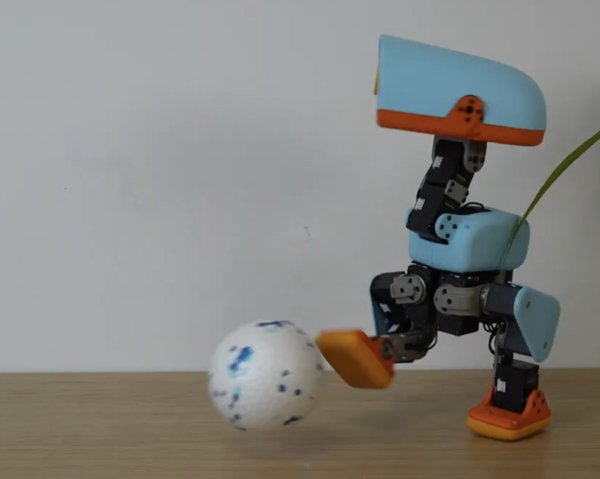
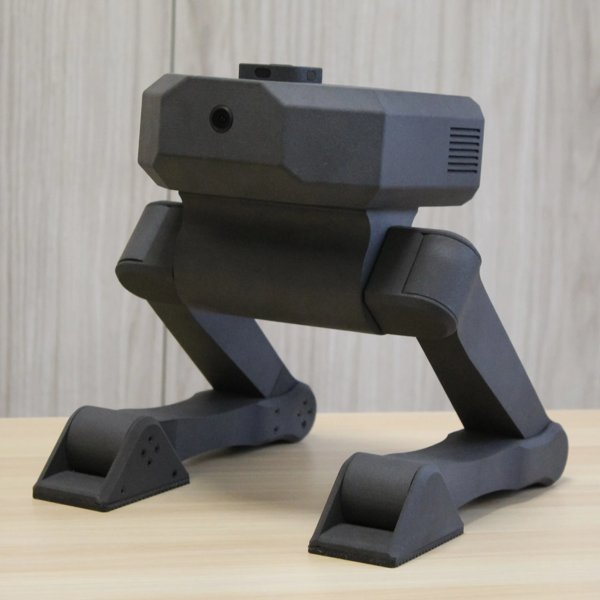
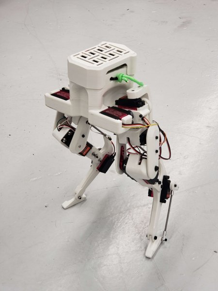
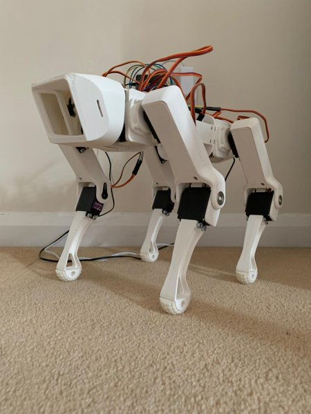
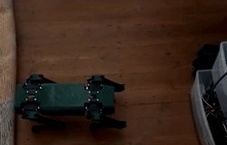
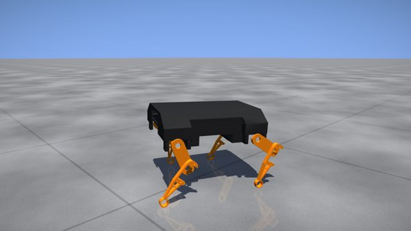
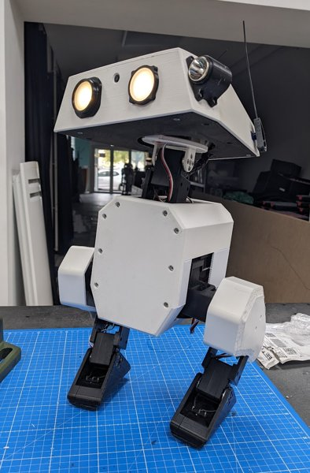

# Robot supportati da AP_NNMixer

[README](../../README.it.md) · [Training compatibile con ArduPilot](training.md)

Ogni robot ha una **topologia** fissata al boot (`NNM_ROBOT`) e **policy** proprie, scambiabili a caldo solo dentro la sua cartella (`NNM_POLICY`). Una policy di un altro robot viene rifiutata dal firmware (controllo su `robot_id` e dimensioni).

Tutti i robot usano la stessa architettura PPO di MicroDuck (MLP 512-256-128 ELU, int8 per riga); cambiano solo ingresso e uscita.

## Configurazioni disponibili

| `NNM_ROBOT` | Foto | Robot | Classe | Giunti | Osservazione | Hz | Collegamento | Policy | Stato |
|---:|---|---|---|---:|---:|---:|---|---|---|
| 0 | <a href="microduck.md"></a> | [MicroDuck](microduck.md) | bipede | 14 | 61 | 50 | bus | `walk.nnm` | policy int8 disponibile; la stessa rete in float32 è validata in SITL e HIL |
| 1 | <a href="microban.md"></a> | [Microban](microban.md) | bipede | 18 | 63 | 50 | bus | `walk.nnm` | policy upstream convertita in int8; simulazione e training pronti |
| 2 | <a href="zeroth.md"></a> | [Zeroth-01](zeroth.md) | bipede | 20 | 69 | 50 | bus | — | manca una scena MuJoCo pronta per il training |
| 3 | <a href="bimo.md"></a> | [Bimo](bimo.md) | bipede | 8 | 33 | 25 | bus | — | manca una scena MuJoCo pronta per il training |
| 4 | <a href="legolas.md"></a> | [Legolas](legolas.md) | bipede | 10 | 39 | 50 | pwm | — | manca una scena MuJoCo pronta per il training |
| 5 | <a href="upkie.md"></a> | [Upkie (wheeled biped)](upkie.md) | bipede | 6 | 27 | 50 | can | — | serve un tipo di azione per giunto nel firmware (ruote in velocità) |
| 6 | <a href="rex.md"></a> | [Rex / SpotMicro](rex.md) | quadrupede | 12 | 45 | 50 | pwm | — | scena MuJoCo generata dall'URDF; policy da addestrare |
| 7 | <a href="yertle.md"></a> | [Yertle](yertle.md) | quadrupede | 12 | 45 | 50 | pwm | — | scena MuJoCo generata dall'URDF; policy da addestrare |
| 8 | <a href="albert.md"></a> | [AlbertPro](albert.md) | quadrupede | 8 | 33 | 50 | pwm | — | scena MuJoCo nativa pronta; policy da addestrare |
| 9 | <a href="openduck.md"></a> | [Open Duck Mini v2](openduck.md) | bipede | 14 | 51 | 50 | bus | — | scena MuJoCo nativa pronta; policy da addestrare |
| 10 | <a href="freenove.md"></a> | [Freenove Robot Dog](freenove.md) | quadrupede | 12 | 45 | 50 | pwm | — | scena MuJoCo ricostruita dalla cinematica upstream; policy da addestrare |

Le foto vengono dai repository originali; fonte sotto l'immagine in ogni scheda.

Collegamento: `bus` = servo su bus seriale: serve il backend bus nel firmware (non ancora scritto); `pwm` = servo PWM: collegabili alle uscite dell'autopilota; `can` = attuatori CAN-FD mjbots: serve un backend dedicato.

## Struttura dei file (repo e microSD)

```
robots/<id>/robot/profile.json   topologia              ->  /APM/nnm/<id>/robot.bin
robots/<id>/robot/ppo.yaml       architettura PPO + ambiente di training
robots/<id>/robot/scene.xml      scena MuJoCo (generata dall'URDF quando serve)
robots/<id>/policies/*.nnm       policy int8            ->  /APM/nnm/<id>/policies/*.nnm
```

`tools/robots/catalog.py` è l'unica fonte dei dati; `tools/robots/build_catalog.py` rigenera profili, `ppo.yaml` e queste pagine.

## Cosa manca per l'hardware

- Robot con servo su bus (Dynamixel, Feetech): un backend bus nel firmware. Oggi le uscite sono funzioni servo Scripting1..16, sufficienti per SITL, HIL e servo PWM.
- Robot con servo PWM: una calibrazione per giunto (verso, centro, rad/µs) in `robot.bin`.
- Upkie: un tipo di azione per giunto (le ruote vanno in velocità).
