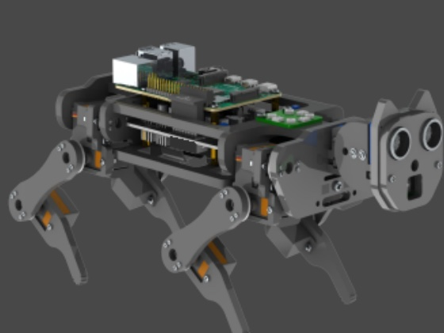

# Freenove Robot Dog

[Catalogo robot](README.md) · [Training compatibile con ArduPilot](training.md) · [README](../../README.it.md)



*Freenove Robot Dog, render del client Freenove (Tutorial.pdf, capitolo 4). Foto: [github.com/Freenove/Freenove_Robot_Dog_Kit_for_Raspberry_Pi](https://github.com/Freenove/Freenove_Robot_Dog_Kit_for_Raspberry_Pi).*

| | |
|---|---|
| Id (cartella) | `freenove` |
| `NNM_ROBOT` | **10** |
| Classe | quadrupede |
| Progetto | Freenove (kit FNK0050) |
| Stato | policy int8 addestrata in simulazione; video dei checkpoint nella scheda |
| Giunti comandati | 12 |
| Osservazione | 45 valori |
| Frequenza policy | 50 Hz |
| Attuatori | 12× EMAX ES08MA II (12 g, analogici, 1,6 kgf·cm a 4,8 V) su PCA9685 0x40 a 50 Hz; Raspberry Pi, IMU MPU6050 |
| Collegamento | servo PWM: collegabili alle uscite dell'autopilota |
| Licenza upstream | CC BY-NC-SA 3.0 (uso non commerciale) |

## Repo originale e file di base

- Repository: [github.com/Freenove/Freenove_Robot_Dog_Kit_for_Raspberry_Pi](https://github.com/Freenove/Freenove_Robot_Dog_Kit_for_Raspberry_Pi)
- Modello MuJoCo (in questo repo): [`robots/freenove/robot/freenove.xml`](../../robots/freenove/robot/freenove.xml)
- CAD e parti stampabili: non pubblicato (parti in acrilico tagliate al laser; solo Head_Part_2D.dwg nel repo)
- BOM e montaggio: Tutorial.pdf nel repo upstream (elenco parti, montaggio, cablaggio Step 13); servono 2× 18650 non protette e un Raspberry Pi 5 / 4B / 3B+
- Training upstream: nessuno upstream (passo open-loop in Control.py: traiettorie ellittiche dei piedi + IK, bilanciamento PID sull'IMU)
- Policy upstream: nessuna

Per scaricare il repo originale e preparare la scena usata da simulazione e training:

```bash
.venv/bin/python tools/robots/fetch_upstream.py --robot freenove
```

Nota sul modello: nessun URDF, MJCF o CAD 3D upstream (solo Head_Part_2D.dwg): il modello robots/freenove/robot/freenove.xml è ricostruito dalla cinematica di Code/Server/Control.py, generato da tools/robots/freenove_mjcf.py e versionato in questo repo. Per cambiare masse, servo o misure si modifica lo script e si rigenera: `.venv/bin/python tools/robots/freenove_mjcf.py --gait`.

## Topologia

File: [`robots/freenove/robot/profile.json`](../../robots/freenove/robot/profile.json) → `robot.bin` sulla microSD. Ordine dei giunti = ordine di osservazione, azione e uscite servo.

| # | Giunto | q0 (rad) | Uscita servo | Canale PCA9685 upstream | Verso |
|---:|---|---:|---|---:|---:|
| 0 | `FL_hip_roll` | +0.1007 | `SERVO1_FUNCTION 94` | 4 | -1 |
| 1 | `FL_hip_pitch` | +0.6635 | `SERVO2_FUNCTION 95` | 3 | +1 |
| 2 | `FL_knee` | -0.0161 | `SERVO3_FUNCTION 96` | 2 | -1 |
| 3 | `FR_hip_roll` | -0.1007 | `SERVO4_FUNCTION 97` | 11 | -1 |
| 4 | `FR_hip_pitch` | +0.6635 | `SERVO5_FUNCTION 98` | 12 | -1 |
| 5 | `FR_knee` | -0.0161 | `SERVO6_FUNCTION 99` | 13 | +1 |
| 6 | `RL_hip_roll` | +0.1007 | `SERVO7_FUNCTION 100` | 7 | -1 |
| 7 | `RL_hip_pitch` | +0.6635 | `SERVO8_FUNCTION 101` | 6 | +1 |
| 8 | `RL_knee` | -0.0161 | `SERVO9_FUNCTION 102` | 5 | -1 |
| 9 | `RR_hip_roll` | -0.1007 | `SERVO10_FUNCTION 103` | 8 | -1 |
| 10 | `RR_hip_pitch` | +0.6635 | `SERVO11_FUNCTION 104` | 9 | -1 |
| 11 | `RR_knee` | -0.0161 | `SERVO12_FUNCTION 105` | 10 | +1 |

Canale e verso vengono dal codice upstream: angolo servo = 90° + verso × q (in gradi), più l'offset di calibrazione del singolo servo.

Osservazione (45): gyro FLU 3, gravità FLU 3, q−q0 12, q̇ 12, azione precedente 12, twist vx vy ωz 3.
Azione (12): offset in radianti, `q_target = q0 + azione`.

## Modello meccanico e confronto con AlbertPro

| Grandezza | Freenove Robot Dog | AlbertPro | Fonte |
|---|---|---|---|
| Gradi di libertà per zampa | 3: abduzione, anca, ginocchio | 2: anca, ginocchio | `Control.coordinateToAngle()` |
| Giunti comandati | 12 | 8 | Step 13 del tutorial (12 servo zampe + 1 testa) |
| Interasse anche (x × y) | 136 × 76 mm | 110 × 110 mm | `Control.postureBalance()`: l, b |
| Asse abduzione → asse anca | 23 mm, verticale a riposo | — | `coordinateToAngle()`: l1 |
| Coscia / tibia | 55 / 55 mm | 30 / 42 mm nel MJCF (5 / 5 cm dichiarati) | `coordinateToAngle()`: l2, l3 |
| Configurazione della zampa | coscia indietro, tibia in avanti (ginocchio verso dietro) | uguale | `angleToCoordinate()` e foto dello stand |
| Piede in stand rispetto all'anca | +10 mm avanti, 10 mm verso l'esterno, 99 mm sotto | −3 mm, 8 mm, 56 mm sotto | `Control.stop()` |
| Massa | circa 0,55 kg (stima per componenti) | 1,38 kg nel MJCF (densità di default sulle mesh) | non pubblicata; 970 g è il peso della confezione |
| Servo | 12× EMAX ES08MA II, 0,16–0,20 N·m, 0,12 s/60° | 8 servo PWM non specificati | elenco parti del tutorial; datasheet EMAX |
| Corsa servo | 18°–162° (±72° attorno a 90°) | limiti nel MJCF | `Servo.angleMin/angleMax` |
| Driver PWM | PCA9685 0x40, 50 Hz, 500–2500 µs su 0–180° | PCA9685 su ESP32 | `Servo.py`, `PCA9685.py` |
| Attuatore nel MJCF | posizione kp 2 N·m/rad, kv 0,02, coppia ±0,17 N·m | posizione kp 60 senza limite di coppia | datasheet ES08MA II |
| IMU | MPU6050 0x68 sulla shield | nessuna nell'osservazione upstream | `IMU.py` |

## Architettura PPO

File: [`robots/freenove/robot/ppo.yaml`](../../robots/freenove/robot/ppo.yaml). Stessa rete di MicroDuck, già provata su Pixhawk 6C: **45 → 512 → 256 → 128 → 12**, ELU, normalizzazione dell'osservazione incorporata. Pesi int8 per riga addestrati sulla griglia int8 dalla prima iterazione (QAT), attivazioni float32. PPO: 2048 ambienti × 24 passi, 5 epoche, 4 minibatch, lr 1e-3 adattivo (KL 0,01), γ 0,99, λ 0,95, clip 0,2.

## Policy

Cartella: [`robots/freenove/policies/`](../../robots/freenove/policies/) → sulla microSD `/APM/nnm/freenove/policies/`. `NNM_POLICY` = indice del file in ordine alfabetico.

| File | Dimensione | Descrizione |
|---|---:|---|
| `walk_v7.nnm` | 192 KB | addestrata da zero sul contratto ArduPilot in int8 (QAT), ambiente walk_v7 (passo da cane, un comando per asse). Checkpoint dell'iterazione 3000 (15000 epoche PPO, punteggio 0,59). In valutazione sopravvive sempre: avanti 0,21 m/s a comando 0,15; indietro, laterale e rotazione non ancora seguiti. |

### Risultati per versione di ambiente ed epoca

Ogni link è la policy int8, quella che gira sull'autopilota, a quel checkpoint. La versione è la configurazione di reward e comandi di quel run (`robots/freenove/robot/ppo.yaml` ne tiene l'ultima). Un'iterazione di training esegue 5 epoche PPO.

| Versione ambiente | Iterazione | Epoche PPO | Video | Risultato |
|---|---:|---:|---|---|
| `walk_v7` | 2700 | 13500 | [`freenove_walk_v7_it2700.mp4`](../media/freenove_walk_v7_it2700.mp4) | Ultimo video di comportamento, prima del checkpoint pubblicato (iterazione 3000). Non cade, tronco a 10 cm. Avanti dritto a circa 0,2 m/s; indietro, laterale e rotazione restano fermi. Circa 20 atterraggi al secondo. |
| `walk_v7` | 2000 | 10000 | [`freenove_walk_v7_it2000.mp4`](../media/freenove_walk_v7_it2000.mp4) | Cammina avanti, alto sui piedi, più calmo di walk_v5: giunti 4,5 rad/s, due o più piedi a terra l'80% del tempo. |
| `walk_v7` | 1600 | 8000 | [`freenove_walk_v7_it1600.mp4`](../media/freenove_walk_v7_it1600.mp4) | Ripresa da walk_v6 con la penalità per lo stare fermo. Ancora poco spostamento nella direzione comandata. |
| `walk_v5` | 900 | 4500 | [`freenove_walk_v5_it0900.mp4`](../media/freenove_walk_v5_it0900.mp4) | Primo checkpoint che avanza (0,17 m/s) con la sequenza dei passi del cane, ma frenetico: 7,7 rad/s e circa 260° di rotazione nei 5 s di avanti. |
| `walk_v5` | 0–200 | 0–1000 | [`freenove_evolution_v5.mp4`](../media/freenove_evolution_v5.mp4) | Alto sui piedi e solleva una zampa alla volta, senza seguire la direzione. |
| `walk_v4` | 0–900 | 0–4500 | [`freenove_evolution_v4.mp4`](../media/freenove_evolution_v4.mp4) | Dall'iterazione 900 si sposta saltando e ruotando, non con un passo. |
| `walk_v2` | 0–400 | 0–2000 | [`freenove_evolution_v2.mp4`](../media/freenove_evolution_v2.mp4) | Impara solo a stare in piedi, accucciato e fermo, qualunque sia il comando. |
| `walk` | 0–300 | 0–1500 | [`freenove_evolution_it0300.mp4`](../media/freenove_evolution_it0300.mp4) | Prima configurazione. Dalla iterazione 100 resta in piedi vibrando le zampe sul posto, senza camminare. |
| `walk` | 100 | 500 | [`freenove_walk_it0100.mp4`](../media/freenove_walk_it0100.mp4) | Sequenza completa dei comandi. In piedi per 26 s, spostamento netto 0,21 m, rotazione non comandata. |

## Training compatibile con ArduPilot

L'ambiente è già il deployment: fisica a 200 Hz come il loop dell'autopilota, gravità dal filtro IMU del firmware, azione tagliata a `NNM_ACT_MAX` e codificata in PWM, osservazione nell'ordine del profilo. Dettagli in [training.md](training.md).

```bash
.venv/bin/python tools/robots/nnm_env.py --robot freenove                       # carica la scena, passo a policy zero
.venv/bin/python tools/robots/train_velocity.py --robot freenove --envs 8 --iters 200 --name walk
.venv/bin/python tools/robots/train_velocity.py --robot freenove --eval robots/freenove/policies/walk.nnm
```

Il trainer CPU serve per verifiche e rifiniture brevi. Per una policy completa (2048 ambienti × 2000 iterazioni) si usa mjlab su GPU con gli stessi due pezzi: `deploy_contract.py` per osservazione e azione, `nnm_qat.enable_qat()` sull'actor, `export_nnm_from_actor()` per il file.

## Deploy sull'autopilota

```bash
python tools/robots/pack_robot_bin.py --robot freenove          # robot.bin dal profilo
# microSD: /APM/nnm/freenove/robot.bin  e  /APM/nnm/freenove/policies/*.nnm
```

Parametri: `NNM_ENABLE 1`, `NNM_ROBOT 10` (riavvio), `NNM_POLICY 0`, `SERVO1..12_FUNCTION 94..105`, `INS_GYRO_FILTER 0`, `SCHED_LOOP_RATE 200`.

## Note

- Rispetto ad AlbertPro, usato come base per la locomozione, il modello meccanico è diverso: 3 giunti per zampa invece di 2 (in più l'abduzione), segmenti di 55 mm invece di 30/42, anche su un rettangolo di 136 × 76 mm invece di 110 × 110. Restano uguali la configurazione della zampa (ginocchio verso dietro), il driver PCA9685 e l'attuatore di posizione; il resto è stato corretto. La tabella sopra elenca ogni voce.
- Lo zero dei giunti è la posa di montaggio del tutorial (tutti i servo a 90°): coscia verticale, tibia orizzontale in avanti. Così un giunto a 0 corrisponde a 1500 µs sia sul filo NNMixer sia sul servo.
- Scala da applicare in robot.bin: il filo NNMixer vale 3 mrad/µs, il servo Freenove 2000 µs su π rad (1,571 mrad/µs), quindi µs_servo = 1500 + segno × 1,910 × (µs_filo − 1500), più l'offset di calibrazione del singolo servo.
- Modello MuJoCo: geometrie visive (gruppo 2) sulle foto del tutorial, geometrie di collisione (gruppo 3) che portano le masse, keyframe `home` nello stand, camere `track`, `side`, `front`, sensori IMU e di contatto ai piedi. Verifica: il passo open-loop di Control.py, eseguito sul modello con la sua IK, avanza di 17 cm in 3,5 s e ruota di 50° in 3,5 s senza cadere ([video](../media/freenove_model_gait.mp4)).
- Masse e rigidezza dei servo sono stime: pesare il robot montato e aggiornare MASS in tools/robots/freenove_mjcf.py. In stand su 4 zampe il ginocchio lavora a circa 0,05 N·m; al trotto, con 2 zampe in appoggio, circa 0,11 N·m statici, due terzi dello stallo a 4,8 V: per questo vx è limitata a ±0,2 m/s.
- Servo analogici aggiornati a 50 Hz dal PCA9685: la policy a 50 Hz è il massimo utile.
- I 12 servo si collegano direttamente alle uscite dell'autopilota (12 ≤ 16) al posto del PCA9685; manca ancora in robot.bin la calibrazione per giunto.
- Licenza CC BY-NC-SA 3.0: modello e policy derivati non vanno usati per scopi commerciali.
