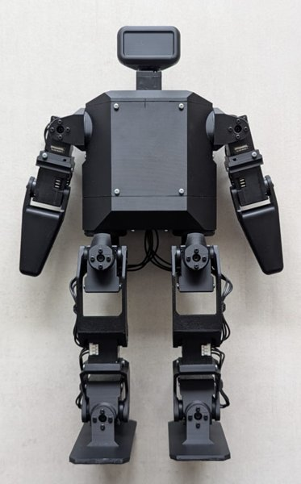
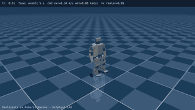

# Microban

[Catalogo robot](README.md) · [Training compatibile con ArduPilot](training.md) · [README](../../README.it.md)



*Microban, robot montato. Foto: [github.com/Rhoban/microban](https://github.com/Rhoban/microban).*

| | |
|---|---|
| Id (cartella) | `microban` |
| `NNM_ROBOT` | **1** |
| Classe | bipede |
| Progetto | Rhoban |
| Stato | walk_md.nnm addestrata sul contratto ArduPilot; walk.nnm upstream da rifinire |
| Giunti comandati | 18 |
| Osservazione | 63 valori |
| Frequenza policy | 50 Hz |
| Attuatori | 19× Dynamixel XL330-M288-T (bus); la testa non è comandata dalla policy |
| Collegamento | servo su bus seriale: serve il backend bus nel firmware (non ancora scritto) |
| Licenza upstream | Apache-2.0 (software); repo hardware GPL-3.0 / CC BY-NC-SA 4.0 |

## Repo originale e file di base

- Repository: [github.com/Rhoban/mjlab_microban](https://github.com/Rhoban/mjlab_microban)
- Hardware: [github.com/Rhoban/microban](https://github.com/Rhoban/microban)
- Scena MuJoCo upstream: [`src/mjlab_microban/robot/microban/scene.xml`](https://github.com/Rhoban/mjlab_microban/blob/main/src/mjlab_microban/robot/microban/scene.xml)
- CAD e parti stampabili: [github.com/Rhoban/microban/tree/main/cad](https://github.com/Rhoban/microban/tree/main/cad) (stl/, step/) e Onshape [cad.onshape.com/documents/d424992a192a8ce34ffce163](https://cad.onshape.com/documents/d424992a192a8ce34ffce163)
- BOM e montaggio: [github.com/Rhoban/microban/tree/main/docs](https://github.com/Rhoban/microban/tree/main/docs) (bom.md, printing.md, assembly.md)
- Training upstream: mjlab 1.3.0 + rsl_rl PPO, modello attuatore BAM XL330 (kp_fw 125)
- Policy upstream: [github.com/Rhoban/microban/blob/main/src/agents/walk.onnx](https://github.com/Rhoban/microban/blob/main/src/agents/walk.onnx)

Per scaricare il repo originale e preparare la scena usata da simulazione e training:

```bash
.venv/bin/python tools/robots/fetch_upstream.py --robot microban
```

## Topologia

File: [`robots/microban/robot/profile.json`](../../robots/microban/robot/profile.json) → `robot.bin` sulla microSD. Ordine dei giunti = ordine di osservazione, azione e uscite servo.

| # | Giunto | q0 (rad) | Uscita servo |
|---:|---|---:|---|
| 0 | `right_shoulder_pitch` | +0.0000 | `SERVO1_FUNCTION 94` |
| 1 | `right_shoulder_roll` | -0.1745 | `SERVO2_FUNCTION 95` |
| 2 | `right_elbow` | -0.3491 | `SERVO3_FUNCTION 96` |
| 3 | `right_hip_yaw` | +0.0000 | `SERVO4_FUNCTION 97` |
| 4 | `right_hip_roll` | -0.0873 | `SERVO5_FUNCTION 98` |
| 5 | `right_hip_pitch` | -0.1745 | `SERVO6_FUNCTION 99` |
| 6 | `right_knee` | +0.0000 | `SERVO7_FUNCTION 100` |
| 7 | `right_ankle_pitch` | +0.0000 | `SERVO8_FUNCTION 101` |
| 8 | `right_ankle_roll` | +0.0873 | `SERVO9_FUNCTION 102` |
| 9 | `left_shoulder_pitch` | +0.0000 | `SERVO10_FUNCTION 103` |
| 10 | `left_shoulder_roll` | +0.1745 | `SERVO11_FUNCTION 104` |
| 11 | `left_elbow` | -0.3491 | `SERVO12_FUNCTION 105` |
| 12 | `left_hip_yaw` | +0.0000 | `SERVO13_FUNCTION 106` |
| 13 | `left_hip_roll` | +0.0873 | `SERVO14_FUNCTION 107` |
| 14 | `left_hip_pitch` | -0.1745 | `SERVO15_FUNCTION 108` |
| 15 | `left_knee` | +0.0000 | `SERVO16_FUNCTION 109` |
| 16 | `left_ankle_pitch` | +0.0000 | oltre Scripting16: serve il backend bus |
| 17 | `left_ankle_roll` | -0.0873 | oltre Scripting16: serve il backend bus |

Osservazione (63): gyro FLU 3, gravità FLU 3, q−q0 18, q̇ 18, azione precedente 18, twist vx vy ωz 3.
Azione (18): offset in radianti, `q_target = q0 + azione`.

## Architettura PPO

File: [`robots/microban/robot/ppo.yaml`](../../robots/microban/robot/ppo.yaml). Stessa rete di MicroDuck, già provata su Pixhawk 6C: **63 → 512 → 256 → 128 → 18**, ELU, normalizzazione dell'osservazione incorporata. Pesi int8 per riga addestrati sulla griglia int8 dalla prima iterazione (QAT), attivazioni float32. PPO: 2048 ambienti × 24 passi, 5 epoche, 4 minibatch, lr 1e-3 adattivo (KL 0,01), γ 0,99, λ 0,95, clip 0,2.

## Policy

Cartella: [`robots/microban/policies/`](../../robots/microban/policies/) → sulla microSD `/APM/nnm/microban/policies/`. `NNM_POLICY` = indice del file in ordine alfabetico.

| File | Dimensione | Descrizione |
|---|---:|---|
| `walk.nnm` | 201 KB | walk.onnx pubblicato da Rhoban (MLP 63-512-256-128-18, stesso contratto NNMixer) convertito in int8 per riga. Nell'ambiente a contratto: in piedi 10 s, avanti cade a 6,8 s, rotazione cade a 1 s. Con la gravità esatta del simulatore regge 10 s in avanti: la policy è stata addestrata senza il filtro IMU dell'autopilota. Da rifinire con --init-onnx prima dell'uso. |
| `walk_md.nnm` | 201 KB | addestrata da zero sul contratto ArduPilot in int8 (QAT): reward e curriculum del task MicroDuck più premi sul passo (appoggio singolo, piede sollevato, alternanza, simmetria), 512 env × 3000 iterazioni, checkpoint 2700 (punteggio 0,64). Sopravvivenza 100% in tutte le modalità; avanti/indietro ~0,16-0,19 m/s a comando 0,3; rotazione 0,68-0,87 rad/s a comando 0,8; laterale 0,04 m/s a comando 0,2; passo alternato e simmetrico (3-4 cm, 0,27-0,29 s per piede). W&B mjlab_microban/h5e7djou. |

### Risultati per versione di ambiente ed epoca

Ogni link è la policy int8, quella che gira sull'autopilota, a quel checkpoint. La versione è la configurazione di reward e comandi di quel run (`robots/microban/robot/ppo.yaml` ne tiene l'ultima). Un'iterazione di training esegue 5 epoche PPO.

| Versione ambiente | Iterazione | Epoche PPO | Video | Risultato |
|---|---:|---:|---|---|
| `walk_md` | 3000 | 15000 | [`microban_walk_md_it3000.mp4`](../media/microban_walk_md_it3000.mp4) | Ambiente allineato a MicroDuck più premi sul passo. Avanti 5 s a 0,3 m/s, destra 3 s, 180° a sinistra, avanti 5 s: nessuna caduta in 16,7 s, 2,4 m percorsi. |
| `walk_md` | 0–3000 | 0–15000 | [`microban_md_evolution.mp4`](../media/microban_md_evolution.mp4) | Evoluzione dello stesso ambiente: stessi comandi sui checkpoint successivi. |
| `walk_gait_v1` | 900 | 4500 | [`microban_gait_best_it900.mp4`](../media/microban_gait_best_it900.mp4) | Miglior checkpoint del run sul passo. Sta in piedi e ruota sul posto; l'avanzamento resta sotto 0,1 m. |
| `walk_gait_v1` | 0–1400 | 0–7000 | [`microban_evolution.mp4`](../media/microban_evolution.mp4) | 14 clip, avanti 4 s poi rotazione. Entro 100 iterazioni non cade; dalla 500 ruota; in avanti si sposta di pochi centimetri. |
| `walk_ap` | 200 | 1000 | [`microban_sequence_it200.mp4`](../media/microban_sequence_it200.mp4) | Rifinitura della policy upstream. Resta in piedi; la velocità comandata non è ancora seguita. |

### Risultato dopo 3000 iterazioni (`walk_md.nnm`)

<a href="../media/microban_walk_md_it3000.mp4"></a>

*Ambiente allineato a MicroDuck più premi sul passo. Avanti 5 s a 0,3 m/s, destra 3 s, 180° a sinistra, avanti 5 s: nessuna caduta in 16,7 s, 2,4 m percorsi. Video: [`docs/media/microban_walk_md_it3000.mp4`](../media/microban_walk_md_it3000.mp4).*

## Training compatibile con ArduPilot

L'ambiente è già il deployment: fisica a 200 Hz come il loop dell'autopilota, gravità dal filtro IMU del firmware, azione tagliata a `NNM_ACT_MAX` e codificata in PWM, osservazione nell'ordine del profilo. Dettagli in [training.md](training.md).

```bash
.venv/bin/python tools/robots/nnm_env.py --robot microban                       # carica la scena, passo a policy zero
.venv/bin/python tools/robots/train_velocity.py --robot microban --envs 8 --iters 200 --name walk
.venv/bin/python tools/robots/train_velocity.py --robot microban --init-onnx robots/microban/policies/walk.onnx --name walk_ap   # rifinitura (ONNX scaricato da fetch_upstream.py)
.venv/bin/python tools/robots/train_velocity.py --robot microban --eval robots/microban/policies/walk.nnm
```

Il trainer CPU serve per verifiche e rifiniture brevi. Per una policy completa (2048 ambienti × 2000 iterazioni) si usa mjlab su GPU con gli stessi due pezzi: `deploy_contract.py` per osservazione e azione, `nnm_qat.enable_qat()` sull'actor, `export_nnm_from_actor()` per il file.

## Deploy sull'autopilota

```bash
python tools/robots/pack_robot_bin.py --robot microban          # robot.bin dal profilo
# microSD: /APM/nnm/microban/robot.bin  e  /APM/nnm/microban/policies/*.nnm
```

Con 18 giunti il firmware attuale rifiuta `robot.bin` (massimo 16 funzioni servo Scripting). Il deploy richiede il backend bus; simulazione, training e file `.nnm` sono già pronti.

## Note

- L'osservazione dell'ONNX è gyro, gravità proiettata, q−q0, q̇, azione precedente, twist: il formato NNMixer con 18 giunti, quindi la policy pubblicata si converte senza riaddestrarla.
- 18 giunti superano le 16 funzioni servo Scripting consecutive: il firmware rifiuta questa topologia finché non esiste un backend bus Dynamixel. Simulazione e training funzionano già.
