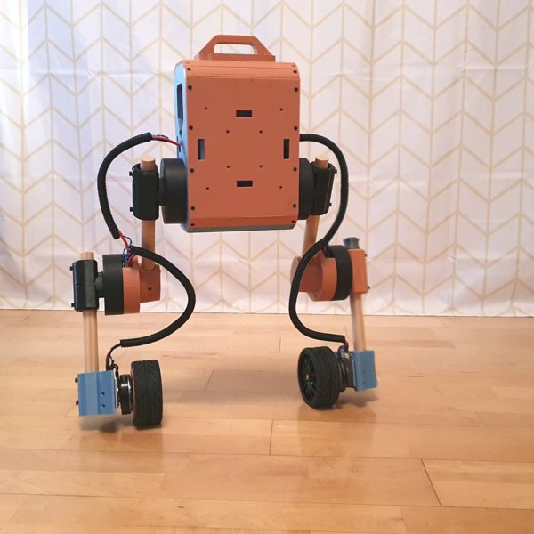

# Upkie (wheeled biped)

[Catalogo robot](README.md) · [Training compatibile con ArduPilot](training.md) · [README](../../README.it.md)



*Upkie (wheeled biped), robot montato. Foto: [github.com/upkie/upkie](https://github.com/upkie/upkie).*

| | |
|---|---|
| Id (cartella) | `upkie` |
| `NNM_ROBOT` | **5** |
| Classe | bipede |
| Progetto | upkie / Stéphane Caron |
| Stato | serve un tipo di azione per giunto nel firmware (ruote in velocità) |
| Giunti comandati | 6 |
| Osservazione | 27 valori |
| Frequenza policy | 50 Hz |
| Attuatori | 4× mjbots qdd100 (anche, ginocchia), 2× moteus + mj5208 (ruote), CAN-FD |
| Collegamento | attuatori CAN-FD mjbots: serve un backend dedicato |
| Licenza upstream | Apache-2.0 |

## Repo originale e file di base

- Repository: [github.com/upkie/upkie](https://github.com/upkie/upkie)
- Modello MuJoCo e training: [github.com/MarcDcls/mjlab_upkie](https://github.com/MarcDcls/mjlab_upkie)
- Scena MuJoCo upstream: [`src/mjlab_upkie/robot/upkie/scene.xml`](https://github.com/MarcDcls/mjlab_upkie/blob/main/src/mjlab_upkie/robot/upkie/scene.xml)
- CAD e parti stampabili: [github.com/upkie/upkie_parts](https://github.com/upkie/upkie_parts) (FreeCAD, STL, 3MF)
- BOM e montaggio: [upkie.github.io/upkie/build-your-own.html](https://upkie.github.io/upkie/build-your-own.html)
- Training upstream: mjlab 1.3.0 + rsl_rl (MarcDcls/mjlab_upkie)
- Policy upstream: MarcDcls/mjlab_upkie logs/rsl_rl/upkie_velocity/bests/default.onnx (osservazione con quaternione del tronco, ruote in velocità); non convertibile

Per scaricare il repo originale e preparare la scena usata da simulazione e training:

```bash
.venv/bin/python tools/robots/fetch_upstream.py --robot upkie
```

## Topologia

File: [`robots/upkie/robot/profile.json`](../../robots/upkie/robot/profile.json) → `robot.bin` sulla microSD. Ordine dei giunti = ordine di osservazione, azione e uscite servo.

| # | Giunto | q0 (rad) | Uscita servo |
|---:|---|---:|---|
| 0 | `left_hip` | +0.0000 | `SERVO1_FUNCTION 94` |
| 1 | `left_knee` | +0.0000 | `SERVO2_FUNCTION 95` |
| 2 | `left_wheel` | +0.0000 | `SERVO3_FUNCTION 96` |
| 3 | `right_hip` | +0.0000 | `SERVO4_FUNCTION 97` |
| 4 | `right_knee` | +0.0000 | `SERVO5_FUNCTION 98` |
| 5 | `right_wheel` | +0.0000 | `SERVO6_FUNCTION 99` |

Osservazione (27): gyro FLU 3, gravità FLU 3, q−q0 6, q̇ 6, azione precedente 6, twist vx vy ωz 3.
Azione (6): offset in radianti, `q_target = q0 + azione`.

## Architettura PPO

File: [`robots/upkie/robot/ppo.yaml`](../../robots/upkie/robot/ppo.yaml). Stessa rete di MicroDuck, già provata su Pixhawk 6C: **27 → 512 → 256 → 128 → 6**, ELU, normalizzazione dell'osservazione incorporata. Pesi int8 per riga addestrati sulla griglia int8 dalla prima iterazione (QAT), attivazioni float32. PPO: 2048 ambienti × 24 passi, 5 epoche, 4 minibatch, lr 1e-3 adattivo (KL 0,01), γ 0,99, λ 0,95, clip 0,2.

## Policy

Cartella: [`robots/upkie/policies/`](../../robots/upkie/policies/) → sulla microSD `/APM/nnm/upkie/policies/`. `NNM_POLICY` = indice del file in ordine alfabetico.

Nessuna policy ancora: va addestrata (sezione successiva).

## Training compatibile con ArduPilot

L'ambiente è già il deployment: fisica a 200 Hz come il loop dell'autopilota, gravità dal filtro IMU del firmware, azione tagliata a `NNM_ACT_MAX` e codificata in PWM, osservazione nell'ordine del profilo. Dettagli in [training.md](training.md).

```bash
.venv/bin/python tools/robots/nnm_env.py --robot upkie                       # carica la scena, passo a policy zero
.venv/bin/python tools/robots/train_velocity.py --robot upkie --envs 8 --iters 200 --name walk
.venv/bin/python tools/robots/train_velocity.py --robot upkie --eval robots/upkie/policies/walk.nnm
```

Il trainer CPU serve per verifiche e rifiniture brevi. Per una policy completa (2048 ambienti × 2000 iterazioni) si usa mjlab su GPU con gli stessi due pezzi: `deploy_contract.py` per osservazione e azione, `nnm_qat.enable_qat()` sull'actor, `export_nnm_from_actor()` per il file.

## Deploy sull'autopilota

```bash
python tools/robots/pack_robot_bin.py --robot upkie          # robot.bin dal profilo
# microSD: /APM/nnm/upkie/robot.bin  e  /APM/nnm/upkie/policies/*.nnm
```

Parametri: `NNM_ENABLE 1`, `NNM_ROBOT 5` (riavvio), `NNM_POLICY 0`, `SERVO1..6_FUNCTION 94..99`, `INS_GYRO_FILTER 0`, `SCHED_LOOP_RATE 200`.

## Note

- Le ruote ricevono comandi di velocità. AP_NNMixer tratta ogni azione come offset di posizione, quindi Upkie richiede nel firmware un tipo di azione per giunto.
