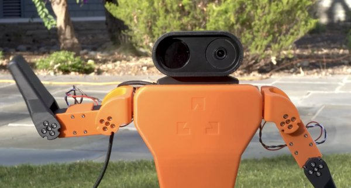

# Zeroth-01

[Catalogo robot](README.md) · [Training compatibile con ArduPilot](training.md) · [README](../../README.it.md)



*Zeroth-01, Zeroth-01. Foto: [github.com/zeroth-robotics/zeroth-bot](https://github.com/zeroth-robotics/zeroth-bot).*

| | |
|---|---|
| Id (cartella) | `zeroth` |
| `NNM_ROBOT` | **2** |
| Classe | bipede |
| Progetto | Zeroth Robotics / K-Scale Labs |
| Stato | manca una scena MuJoCo pronta per il training |
| Giunti comandati | 20 |
| Osservazione | 69 valori |
| Frequenza policy | 50 Hz |
| Attuatori | servo Feetech STS3250 su bus seriale (la documentazione ne indica 16; il task ksim comanda 20 giunti) |
| Collegamento | servo su bus seriale: serve il backend bus nel firmware (non ancora scritto) |
| Licenza upstream | MIT |

## Repo originale e file di base

- Repository: [github.com/zeroth-robotics/zeroth-bot](https://github.com/zeroth-robotics/zeroth-bot)
- CAD e parti stampabili: Onshape [cad.onshape.com/documents/cacc96f8a7850b951e7aa69a](https://cad.onshape.com/documents/cacc96f8a7850b951e7aa69a)
- BOM e montaggio: [docs.kscale.dev/robots/zeroth-01/bom/](https://docs.kscale.dev/robots/zeroth-01/bom/)
- Training upstream: ksim (MuJoCo / JAX), policy ricorrente esportata in .kinfer
- Policy upstream: release V0.2.1 ppo_standing.pt / ppo_walking.pt (pipeline più vecchia, osservazione diversa); non convertibile

Per scaricare il repo originale e preparare la scena usata da simulazione e training:

```bash
.venv/bin/python tools/robots/fetch_upstream.py --robot zeroth
```

Nota sul modello: nessun MJCF nel repo: il task ksim lo scarica con ksim.get_mujoco_model_path('zbot', name='robot') (pip install ksim); salvarlo come robots/zeroth/robot/scene.xml.

## Topologia

File: [`robots/zeroth/robot/profile.json`](../../robots/zeroth/robot/profile.json) → `robot.bin` sulla microSD. Ordine dei giunti = ordine di osservazione, azione e uscite servo.

| # | Giunto | q0 (rad) | Uscita servo |
|---:|---|---:|---|
| 0 | `right_hip_yaw` | +0.0000 | `SERVO1_FUNCTION 94` |
| 1 | `right_hip_roll` | -0.1000 | `SERVO2_FUNCTION 95` |
| 2 | `right_hip_pitch` | -0.4000 | `SERVO3_FUNCTION 96` |
| 3 | `right_knee_pitch` | -0.8000 | `SERVO4_FUNCTION 97` |
| 4 | `right_ankle_pitch` | -0.4000 | `SERVO5_FUNCTION 98` |
| 5 | `right_ankle_roll` | -0.1000 | `SERVO6_FUNCTION 99` |
| 6 | `left_hip_yaw` | +0.0000 | `SERVO7_FUNCTION 100` |
| 7 | `left_hip_roll` | +0.1000 | `SERVO8_FUNCTION 101` |
| 8 | `left_hip_pitch` | -0.4000 | `SERVO9_FUNCTION 102` |
| 9 | `left_knee_pitch` | -0.8000 | `SERVO10_FUNCTION 103` |
| 10 | `left_ankle_pitch` | -0.4000 | `SERVO11_FUNCTION 104` |
| 11 | `left_ankle_roll` | +0.1000 | `SERVO12_FUNCTION 105` |
| 12 | `left_shoulder_pitch` | +0.0000 | `SERVO13_FUNCTION 106` |
| 13 | `left_shoulder_roll` | +0.2000 | `SERVO14_FUNCTION 107` |
| 14 | `left_elbow_roll` | -0.2000 | `SERVO15_FUNCTION 108` |
| 15 | `left_gripper_roll` | +0.0000 | `SERVO16_FUNCTION 109` |
| 16 | `right_shoulder_pitch` | +0.0000 | oltre Scripting16: serve il backend bus |
| 17 | `right_shoulder_roll` | -0.2000 | oltre Scripting16: serve il backend bus |
| 18 | `right_elbow_roll` | +0.2000 | oltre Scripting16: serve il backend bus |
| 19 | `right_gripper_roll` | +0.0000 | oltre Scripting16: serve il backend bus |

Osservazione (69): gyro FLU 3, gravità FLU 3, q−q0 20, q̇ 20, azione precedente 20, twist vx vy ωz 3.
Azione (20): offset in radianti, `q_target = q0 + azione`.

## Architettura PPO

File: [`robots/zeroth/robot/ppo.yaml`](../../robots/zeroth/robot/ppo.yaml). Stessa rete di MicroDuck, già provata su Pixhawk 6C: **69 → 512 → 256 → 128 → 20**, ELU, normalizzazione dell'osservazione incorporata. Pesi int8 per riga addestrati sulla griglia int8 dalla prima iterazione (QAT), attivazioni float32. PPO: 2048 ambienti × 24 passi, 5 epoche, 4 minibatch, lr 1e-3 adattivo (KL 0,01), γ 0,99, λ 0,95, clip 0,2.

## Policy

Cartella: [`robots/zeroth/policies/`](../../robots/zeroth/policies/) → sulla microSD `/APM/nnm/zeroth/policies/`. `NNM_POLICY` = indice del file in ordine alfabetico.

Nessuna policy ancora: va addestrata (sezione successiva).

## Training compatibile con ArduPilot

L'ambiente è già il deployment: fisica a 200 Hz come il loop dell'autopilota, gravità dal filtro IMU del firmware, azione tagliata a `NNM_ACT_MAX` e codificata in PWM, osservazione nell'ordine del profilo. Dettagli in [training.md](training.md).

```bash
.venv/bin/python tools/robots/nnm_env.py --robot zeroth                       # carica la scena, passo a policy zero
.venv/bin/python tools/robots/train_velocity.py --robot zeroth --envs 8 --iters 200 --name walk
.venv/bin/python tools/robots/train_velocity.py --robot zeroth --eval robots/zeroth/policies/walk.nnm
```

Il trainer CPU serve per verifiche e rifiniture brevi. Per una policy completa (2048 ambienti × 2000 iterazioni) si usa mjlab su GPU con gli stessi due pezzi: `deploy_contract.py` per osservazione e azione, `nnm_qat.enable_qat()` sull'actor, `export_nnm_from_actor()` per il file.

## Deploy sull'autopilota

```bash
python tools/robots/pack_robot_bin.py --robot zeroth          # robot.bin dal profilo
# microSD: /APM/nnm/zeroth/robot.bin  e  /APM/nnm/zeroth/policies/*.nnm
```

Con 20 giunti il firmware attuale rifiuta `robot.bin` (massimo 16 funzioni servo Scripting). Il deploy richiede il backend bus; simulazione, training e file `.nnm` sono già pronti.

## Note

- q0 è JOINT_BIASES di ksim-gym-zbot/train.py.
- L'osservazione ksim (quaternione, yaw assoluto, altezza della base) non è il contratto NNMixer: la policy va addestrata con tools/robots/train_velocity.py o mjlab.
- 20 giunti superano le 16 funzioni servo Scripting: sull'autopilota serve il backend bus.
